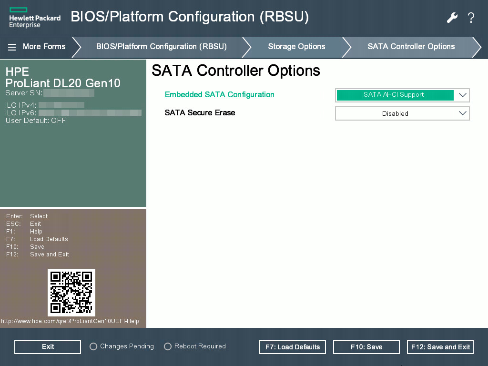
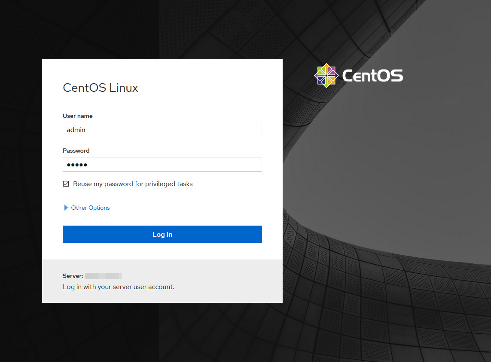
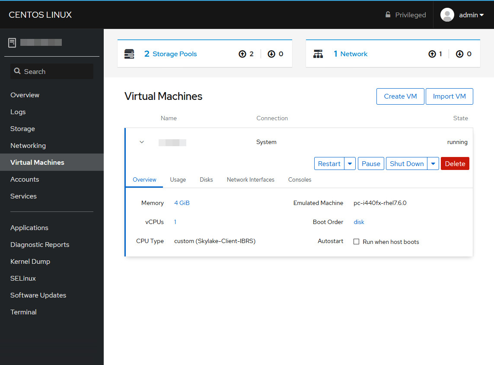
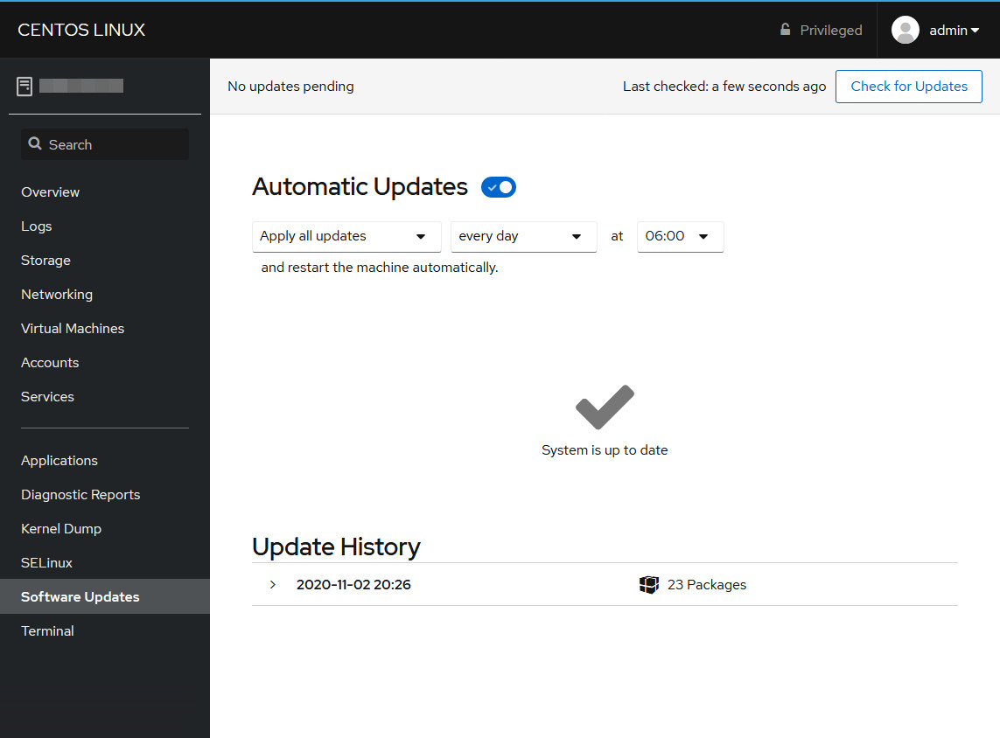

# Installing CentOS 8 on HPE Gen10 Systems

This guide provides notes on installing and configuring [CentOS 8][centos8] on 
an [HPE Proliant DL20 Gen10][hpe-dl20g10-specs] 1U rackmount server. The 
configuration is intended for a lightweight KVM-based virtualization hypervisor 
with a web-based admin interface.

Note, this guide--and all related files--can be downloaded from the link 
provided in the downloads section. This guide is actively maintained and may 
be revised, check [https://kzoo.tech/hpecentos](https://kzoo.tech/hpecentos) for
the most recent version.

## Hardware Configuration

The Proliant DL20 Gen10 may be equipped with various OEM 
[option parts][hpe-dl20g10-parts] which is supported by HPE. Third-party 
hardware is not well-supported by HPE and may cause issues  with thermal sensor
readings.

The following hardware is configured on this system:

* Processor: Intel Xeon E-2224 @ 3.40GHz
* Memory: 2x 8GB DDR4 2666MHz ECC
* Storage: 1TB Samsung EVO 870 SSD
* Option Parts: HPE Dedicated iLO Port/M.2 NVMe SSD/COM Port Upgrade Kit

Note that third-party M.2 SSD drives may cause high system fan speeds
and will operate significantly [louder than normal][reddit-dl20fans] at idle. 
This is caused by a missing temperature reading from the third-party drive. An 
[official HPE advisory][hpe-advsry-m2fanspeed] recommends using only OEM-suplied
M.2 SSD drives.

## BIOS/Platform Configuration

The BIOS/Platform Configuration can be accessed either through a keyboard, mouse 
and monitor; or though the [iLO5 Remote Console][hpe-ilo5] web interface.
Further information about configuring the system can be found in the
[UEFI Utilities][hpe-dl20g10-uefi] user guide.

### SATA Controller Options

The HPE Smart Array S100i SR Gen10 software RAID controller is not supported by
CentOS 8. The Embedded SATA Configuration should be set to `SATA ACHI Support`.

## System Installation

The provided [hpecentos.cfg.example](hpecentos.cfg.example) configuration file 
should be modified for the target system and then used to perform an [automated
installation using Kickstart][centos8-autoinstall]. The following is an example 
boot option for fetching the kickstart file from web server.

	setparams 'Install CentOS Linux 8'
	  linuxefi /images/pxeboot/vmlinuz inst.stage2=hd:LABEL=CentOS-8-2 x86_64-dvd \
	    quiet inst.ip=eno1:dhcp inst.ks=https://abc.xyz/hpecentos.cfg
	  initrdefi /images/pxeboot/initrd.img

Manual installation is also possible, however the iLO Remote Console is only
compatible with text mode. Consider using a monitor or 
[direct VNC][centos8-directvnc] for manual installations.

Note that using the iLO5 Virtual Media operates very slowly and may only work
with text mode installation. Using USB boot media is recommended.

The [hpecentos.cfg.example](hpecentos.cfg.example) kickstart file provided is 
designed for the specific hardware configuration listed above and should be 
modified as needed. The sections below describe parts of the file. More 
information can be found in the 
[Kickstart Commands and Options Reference][centos8-kscommands] documentation.

### Localization

The keyboard layout, default language, timezone and hostname should be adjusted
for each installation's needs.

### Accounts

A local default `admin` account, which is part of the `wheel` group is created. 
This is the account that can be used to login to the [Cockpit][cockpit-project]
web-interface after installation.

The default `root` and `admin` passwords should be changed prior to 
installation.

### Partitioning

A reserve of 10% of the nominal drive capacity is left unallocated. A 256MB 
`/boot/efi` and a 1GB `/boot` partition are created to faciliate UEFI booting. 
An additional 16GB partition is reserved for swap.

The remaining 900GB is used for an LVM Volume Group. Within this volume group,
the following paritions are allocated:

* `/` 25GB (ext4)
* `/tmp` 25GB (ext4)
* `/home` 50GB (ext4)
* `/var` 750GB (ext4) 

Note that, a large `/var`,`/var/lib`, or `/var/lib/libvirt` is necessary to 
accommodate the storage of VM images on the system. Approximately 50GB of the 
volume group is left unallocated for future use.

### Networking

The installation process assumes that a DHCP network connection with access to
the internet is avaiable on `eno1` during installation.

### Packages

The following packages should be marked for installation:

* `@^virtualization-host-environment`,
* `kexec-tools`,
* `cockpit`,
* `cockpit-machines`,
* `cockpit-storaged`, and
* `amsd`.

The `amsd` package is available from 
[HPE Management Component Pack][hpe-sdr-mcp] repository. This package provides
out-of-band communication of server health information to the iLO5 Agentless 
Management Service (AMS). According to an 
[HPE Customer Advisory][hpe-adv-achifans], this package is required on CentOS to 
provide correct temperature data to the AMS, which controls system fan speeds.

## System Configuration

After the system installation and first-time boot initalization have completed,
the web-interface can be accessed from the address `https://w.x.y.z:9090/`. To
login use the username `admin` and the configured password.

More information about the web-interface can be found on the Cockpit Project's
[website][cockpit-project].

### Virtual Machines

Virtual machines can be created and imported in the web-interface by selecting
`Virtual Machines` and following the user interface. 

More information about
virtual machines can be found in the [documentation][rhel8-virt] for RHEL 8.

### Automatic Updates 

Automatic updates can be enabled in the web-interface by selecting `Software 
Updates` and turning on Automatic updates.

Automatic updates requires installation of the `dnf-automatic` package. Enabling
automatic updates will prompt to install this package.

## Errata

Corrections and updates should be sent to <contact@kzoo.tech>. Provide as many 
details as possible when reporting corrections and updates.

Before submitting a correction be sure you are using the latest version of this
guide at [https://kzoo.tech/hpecentos](https://kzoo.tech/hpecentos).

## Download

* [hpecentos-1.0.0.tgz (356 KB)][kzoo-hpecentos-1.0.0]
* [SHA256](SHA256)

## History

`1.0.0 - Initial revision. (02-Nov-2020)`

## Copyright

Copyright (c) 2020, Andrew Alm &lt;<contact@kzoo.tech>&gt;.

This work is licensed under a [Creative Commons Attribution-ShareAlike 4.0
International License][cc-bysa4].

[cc-bysa4]: http://creativecommons.org/licenses/by-sa/4.0/
[centos8]: https://wiki.centos.org/Manuals/ReleaseNotes/CentOSLinux8
[centos8-autoinstall]: https://docs.centos.org/en-US/8-docs/advanced-install/assembly_starting-kickstart-installations/
[centos8-directvnc]: https://docs.centos.org/en-US/8-docs/advanced-install/assembly_performing-a-remote-installation-using-vnc/#performing-a-rhel-install-in-vnc-direct-mode_performing-a-remote-installation-using-vnc
[centos8-kscommands]: https://docs.centos.org/en-US/8-docs/advanced-install/assembly_kickstart-commands-and-options-reference/
[cockpit-project]: https://cockpit-project.org
[hpe-amsd]: https://support.hpe.com/hpesc/public/docDisplay?docLocale=en_US&docId=emr_na-a00026111en_us
[hpe-dl20g10-parts]: https://support.hpe.com/hpesc/public/docDisplay?docLocale=en_US&docId=emr_na-a00059857en_us
[hpe-dl20g10-specs]: https://h20195.www2.hpe.com/v2/GetDocument.aspx?docname=a00053820enw
[hpe-dl20g10-uefi]: https://support.hpe.com/hpesc/public/docDisplay?docId=a00016407en_us
[hpe-ilo5]: https://support.hpe.com/hpesc/public/docDisplay?docId=a00018324en_us
[hpe-sdr-mcp]: https://downloads.linux.hpe.com/SDR/project/mcp/
[hpe-adv-achifans]: https://support.hpe.com/hpesc/public/docDisplay?docLocale=en_US&docId=emr_na-a00083154en_us
[hpe-advsry-m2fanspeed]: https://support.hpe.com/hpesc/public/docDisplay?docId=a00060996en_us&docLocale=en_US
[kzoo-hpecentos-1.0.0]: https://kzoo.tech/hpecentos-1.0.0.tgz
[libvirt]: https://libvirt.org/
[reddit-dl20fans]: https://www.reddit.com/r/homelab/comments/ay1vuw/my_hpe_dl20_gen10_is_loooud/
[rhel8-virt]: https://access.redhat.com/documentation/en-us/red_hat_enterprise_linux/8/html/configuring_and_managing_virtualization/getting-started-with-virtualization-in-rhel-8_configuring-and-managing-virtualization

